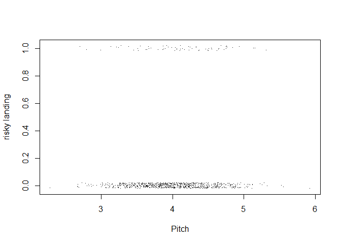

Landing distance of a commercial flight
================
by Hasnat Tahir

``` r
knitr::opts_chunk$set(warning=FALSE,message=FALSE)
```

Libraries

``` r
library(readxl)
library(tidyverse)
library(ggplot2)
library(DataExplorer)
library(broom)
library(dplyr)
library(MASS)
```

Step-1

``` r
faa1 = read_excel('D:\\University\\Pet projects\\Airline\\FAA1.xls')

faa2 = read_excel('D:\\University\\Pet projects\\Airline\\FAA2.xls')

dim(faa1)
```

    ## [1] 800   8

``` r
dim(faa2)
```

    ## [1] 150   7

Both FAA1 and FAA2 data sets have been imported.

Step-2

``` r
str(faa1)
```

    ## Classes 'tbl_df', 'tbl' and 'data.frame':    800 obs. of  8 variables:
    ##  $ aircraft    : chr  "boeing" "boeing" "boeing" "boeing" ...
    ##  $ duration    : num  98.5 125.7 112 196.8 90.1 ...
    ##  $ no_pasg     : num  53 69 61 56 70 55 54 57 61 56 ...
    ##  $ speed_ground: num  107.9 101.7 71.1 85.8 59.9 ...
    ##  $ speed_air   : num  109 103 NA NA NA ...
    ##  $ height      : num  27.4 27.8 18.6 30.7 32.4 ...
    ##  $ pitch       : num  4.04 4.12 4.43 3.88 4.03 ...
    ##  $ distance    : num  3370 2988 1145 1664 1050 ...

``` r
str(faa2)
```

    ## Classes 'tbl_df', 'tbl' and 'data.frame':    150 obs. of  7 variables:
    ##  $ aircraft    : chr  "boeing" "boeing" "boeing" "boeing" ...
    ##  $ no_pasg     : num  53 69 61 56 70 55 54 57 61 56 ...
    ##  $ speed_ground: num  107.9 101.7 71.1 85.8 59.9 ...
    ##  $ speed_air   : num  109 103 NA NA NA ...
    ##  $ height      : num  27.4 27.8 18.6 30.7 32.4 ...
    ##  $ pitch       : num  4.04 4.12 4.43 3.88 4.03 ...
    ##  $ distance    : num  3370 2988 1145 1664 1050 ...

In FAA1 data set there are 800 observations and 8 variables. In FAA2
data set there are 150 observations and 7 variables. The only difference
is that ‘duration’ variable in not present in FAA2 data set.

Step-3

``` r
faa2$duration = NA # adds a duration column to facilitate merging

faa = rbind(faa1, faa2) #merging the two data sets

dim(faa)
```

    ## [1] 950   8

``` r
#duplicate values
faa_uniq = faa %>% distinct(aircraft,distance,no_pasg,speed_ground,speed_air,height,pitch,.keep_all=TRUE)

dim(faa_uniq)
```

    ## [1] 850   8

100 duplicate values were observed. Yes, I got rid of those duplicate
values as they are a result of some error and they might bias the
prediction model.

Step-4

``` r
str(faa_uniq)
```

    ## Classes 'tbl_df', 'tbl' and 'data.frame':    850 obs. of  8 variables:
    ##  $ aircraft    : chr  "boeing" "boeing" "boeing" "boeing" ...
    ##  $ duration    : num  98.5 125.7 112 196.8 90.1 ...
    ##  $ no_pasg     : num  53 69 61 56 70 55 54 57 61 56 ...
    ##  $ speed_ground: num  107.9 101.7 71.1 85.8 59.9 ...
    ##  $ speed_air   : num  109 103 NA NA NA ...
    ##  $ height      : num  27.4 27.8 18.6 30.7 32.4 ...
    ##  $ pitch       : num  4.04 4.12 4.43 3.88 4.03 ...
    ##  $ distance    : num  3370 2988 1145 1664 1050 ...

``` r
summary(faa_uniq)
```

    ##    aircraft            duration         no_pasg      speed_ground   
    ##  Length:850         Min.   : 14.76   Min.   :29.0   Min.   : 27.74  
    ##  Class :character   1st Qu.:119.49   1st Qu.:55.0   1st Qu.: 65.90  
    ##  Mode  :character   Median :153.95   Median :60.0   Median : 79.64  
    ##                     Mean   :154.01   Mean   :60.1   Mean   : 79.45  
    ##                     3rd Qu.:188.91   3rd Qu.:65.0   3rd Qu.: 92.06  
    ##                     Max.   :305.62   Max.   :87.0   Max.   :141.22  
    ##                     NA's   :50                                      
    ##    speed_air          height           pitch          distance      
    ##  Min.   : 90.00   Min.   :-3.546   Min.   :2.284   Min.   :  34.08  
    ##  1st Qu.: 96.25   1st Qu.:23.314   1st Qu.:3.642   1st Qu.: 883.79  
    ##  Median :101.15   Median :30.093   Median :4.008   Median :1258.09  
    ##  Mean   :103.80   Mean   :30.144   Mean   :4.009   Mean   :1526.02  
    ##  3rd Qu.:109.40   3rd Qu.:36.993   3rd Qu.:4.377   3rd Qu.:1936.95  
    ##  Max.   :141.72   Max.   :59.946   Max.   :5.927   Max.   :6533.05  
    ##  NA's   :642

The combined data set ‘faa’ has 950 observations and 8 variables.

### Step-5

Key Observations:

  - The FAA2 data set doesn’t have the duration variable.
  - The Height variable has some negative values.
  - The speed\_air variable has approx 75% of the observation values
    missing.
  - Based on the problem statement, speed\_ground and speed\_air some
    values \<30 mph and \>140 mph that are considered abnormal.
  - Duration variable too has some abnormal values that needs to be
    taken care before doing any analysis.

Step-6

``` r
#Negative Height and abnormal height
Abnormal_Height = faa_uniq[faa_uniq$height < 6,]
Abnormal_Height # 10 values
```

    ## # A tibble: 10 x 8
    ##    aircraft duration no_pasg speed_ground speed_air  height pitch distance
    ##    <chr>       <dbl>   <dbl>        <dbl>     <dbl>   <dbl> <dbl>    <dbl>
    ##  1 boeing       284.      62         58.9        NA  4.26    4.77    426. 
    ##  2 boeing       175.      64         52.5        NA -3.55    4.21    581. 
    ##  3 boeing       146.      69         71.8        NA -1.53    4.20    739. 
    ##  4 boeing       133.      73         57.0        NA  1.25    4.72    371. 
    ##  5 boeing       124.      72         60.4        NA  3.79    3.71    642. 
    ##  6 boeing       120.      68         70.2        NA  2.21    3.74    816. 
    ##  7 airbus       103.      73         93.0        NA -3.33    4.83   1568. 
    ##  8 airbus       158.      68         56.5        NA -0.0678  4.69    380. 
    ##  9 airbus       164.      62         72.0        NA  0.0861  3.62    538. 
    ## 10 airbus       151.      58         66.4        NA -2.92    3.12     34.1

``` r
#Abnormal Speeds
Abnormal_speed = faa_uniq[(faa_uniq$speed_ground >140 | faa_uniq$speed_ground < 30),]
Abnormal_speed # 3 abnormal values
```

    ## # A tibble: 3 x 8
    ##   aircraft duration no_pasg speed_ground speed_air height pitch distance
    ##   <chr>       <dbl>   <dbl>        <dbl>     <dbl>  <dbl> <dbl>    <dbl>
    ## 1 boeing       181.      54        141.       142.   23.6  5.22    6533.
    ## 2 boeing       213.      61         29.2       NA    23.3  4.40    1077.
    ## 3 boeing       142.      46         27.7       NA    24.4  4.37    1324.

``` r
Abnormal_speed2 = faa_uniq[(faa_uniq$speed_air > 140 | faa_uniq$speed_air < 30) & (is.na(faa_uniq$speed_air) ==FALSE),]
Abnormal_speed2 # 1 values
```

    ## # A tibble: 1 x 8
    ##   aircraft duration no_pasg speed_ground speed_air height pitch distance
    ##   <chr>       <dbl>   <dbl>        <dbl>     <dbl>  <dbl> <dbl>    <dbl>
    ## 1 boeing       181.      54         141.      142.   23.6  5.22    6533.

``` r
#Duration
Abnormal_duration = faa_uniq[(faa_uniq$duration< 40) & (is.na(faa_uniq$duration) ==FALSE),]
Abnormal_duration # 5 values
```

    ## # A tibble: 5 x 8
    ##   aircraft duration no_pasg speed_ground speed_air height pitch distance
    ##   <chr>       <dbl>   <dbl>        <dbl>     <dbl>  <dbl> <dbl>    <dbl>
    ## 1 boeing       17.4      63         63.6      NA     28.4  3.94    1032.
    ## 2 boeing       14.8      59        108.      109.    46.9  4.81    3646.
    ## 3 boeing       31.4      51         98.2      99.1   52.5  4.16    2808.
    ## 4 airbus       16.9      54         94.5      95.9   37.5  4.17    2163.
    ## 5 airbus       31.7      61         76.4      NA     31.0  2.82     948.

  - Height has 10 abnormal values.
  - speed\_ground has 3 abnormal values.
  - speed\_air has 1 abnormal values.
  - duration has 5 abnormal values.

<!-- end list -->

``` r
#removing abnormal values

clean_faa = filter(faa_uniq, (faa_uniq$duration > 40 | is.na(faa_uniq$duration == T)))
clean_faa1 = filter(clean_faa, ((clean_faa$speed_air >=30 & clean_faa$speed_air<=140) | is.na(clean_faa$speed_air == T)))

clean_faa2 = filter(clean_faa1, ((clean_faa1$speed_ground >=30 & clean_faa1$speed_ground<=140)))

clean_faa3 = filter(clean_faa2, clean_faa2$height >= 6)
                              
dim(clean_faa3)
```

    ## [1] 832   8

All the abnormal values have been removed.

Step-7

``` r
str(clean_faa3)
```

    ## Classes 'tbl_df', 'tbl' and 'data.frame':    832 obs. of  8 variables:
    ##  $ aircraft    : chr  "boeing" "boeing" "boeing" "boeing" ...
    ##  $ duration    : num  98.5 125.7 112 196.8 90.1 ...
    ##  $ no_pasg     : num  53 69 61 56 70 55 54 57 61 56 ...
    ##  $ speed_ground: num  107.9 101.7 71.1 85.8 59.9 ...
    ##  $ speed_air   : num  109 103 NA NA NA ...
    ##  $ height      : num  27.4 27.8 18.6 30.7 32.4 ...
    ##  $ pitch       : num  4.04 4.12 4.43 3.88 4.03 ...
    ##  $ distance    : num  3370 2988 1145 1664 1050 ...

``` r
summary(clean_faa3)
```

    ##    aircraft            duration         no_pasg       speed_ground   
    ##  Length:832         Min.   : 41.95   Min.   :29.00   Min.   : 33.57  
    ##  Class :character   1st Qu.:119.65   1st Qu.:55.00   1st Qu.: 66.20  
    ##  Mode  :character   Median :154.26   Median :60.00   Median : 79.83  
    ##                     Mean   :154.73   Mean   :60.06   Mean   : 79.61  
    ##                     3rd Qu.:189.64   3rd Qu.:65.00   3rd Qu.: 91.99  
    ##                     Max.   :305.62   Max.   :87.00   Max.   :136.66  
    ##                     NA's   :50                                       
    ##    speed_air          height           pitch          distance      
    ##  Min.   : 90.00   Min.   : 6.228   Min.   :2.284   Min.   :  41.72  
    ##  1st Qu.: 96.25   1st Qu.:23.530   1st Qu.:3.640   1st Qu.: 893.43  
    ##  Median :101.15   Median :30.185   Median :4.002   Median :1263.54  
    ##  Mean   :103.65   Mean   :30.474   Mean   :4.005   Mean   :1528.24  
    ##  3rd Qu.:109.40   3rd Qu.:37.018   3rd Qu.:4.370   3rd Qu.:1937.58  
    ##  Max.   :136.42   Max.   :59.946   Max.   :5.927   Max.   :6309.95  
    ##  NA's   :628

Step-8

``` r
plot_histogram(clean_faa3)
```

<!-- -->

``` r
plot_bar(clean_faa3$aircraft)
```

<!-- -->
Above are the histograms for all the variables.

### Step-9

  - speed\_air and duration variables still have missing values.
  - height, speed\_air, speed\_ground and duration variables had
    abnormal values that have been removed.
  - The final clean data set has 832 observations and 8 variables.

# Part 2

### Step-1

``` r
#binary variables
clean_faa3$long.landing = ifelse(clean_faa3$distance > 2500, 1, 0)
clean_faa3$risky.landing = ifelse(clean_faa3$distance > 3000, 1, 0)

#deleting distance variable
colnames(clean_faa3)
```

    ##  [1] "aircraft"      "duration"      "no_pasg"       "speed_ground" 
    ##  [5] "speed_air"     "height"        "pitch"         "distance"     
    ##  [9] "long.landing"  "risky.landing"

``` r
new_faa = clean_faa3[,-8]
head(new_faa)
```

    ## # A tibble: 6 x 9
    ##   aircraft duration no_pasg speed_ground speed_air height pitch long.landing
    ##   <chr>       <dbl>   <dbl>        <dbl>     <dbl>  <dbl> <dbl>        <dbl>
    ## 1 boeing       98.5      53        108.       109.   27.4  4.04            1
    ## 2 boeing      126.       69        102.       103.   27.8  4.12            1
    ## 3 boeing      112.       61         71.1       NA    18.6  4.43            0
    ## 4 boeing      197.       56         85.8       NA    30.7  3.88            0
    ## 5 boeing       90.1      70         59.9       NA    32.4  4.03            0
    ## 6 boeing      138.       55         75.0       NA    41.2  4.20            0
    ## # ... with 1 more variable: risky.landing <dbl>

``` r
#aircraft to binary
new_faa$aircraft = ifelse(new_faa$aircraft == "airbus", 1,0) 

summary(new_faa$aircraft)
```

    ##    Min. 1st Qu.  Median    Mean 3rd Qu.    Max. 
    ##  0.0000  0.0000  1.0000  0.5337  1.0000  1.0000

``` r
typeof(new_faa$aircraft)
```

    ## [1] "double"

The binary variables long.landing and risky.landing have been created.

### Step-2

``` r
#pie chart showing distribution of long landing
piec = table(new_faa$long.landing)
lbl = c("Normal landing", "Long landing")

pct = c(round(100-round(sum(new_faa$long.landing==1)/length(new_faa))), round(sum(new_faa$long.landing==1)/length(new_faa)))
pct
```

    ## [1] 88 12

``` r
lbl = paste(lbl, pct) 
lbl = paste(lbl,"%",sep="")
pie(piec, labels = lbl, main = "Long Landing")
```

<!-- -->
The above pie charts shows the distribution of Long landing and risky
landing.

### Step-3:

``` r
#Creating table 2
reg_glm = function(dat,vari){
  z = glm(dat$long.landing~vari, family = binomial, data = dat)
  x = tidy(z)$p.value[2]
  y = tidy(z)$estimate[2]
  return(c(y,x))
}

r1 = reg_glm(new_faa, new_faa$aircraft)
r2 = reg_glm(new_faa, new_faa$duration)
r3 = reg_glm(new_faa, new_faa$no_pasg)
r4 = reg_glm(new_faa, new_faa$speed_ground)
r5 = reg_glm(new_faa, new_faa$speed_air)
r6 = reg_glm(new_faa, new_faa$height)
r7 = reg_glm(new_faa, new_faa$pitch)

tabl = rbind(r1,r2,r3,r4,r5,r6,r7)


colnames(tabl) = c('Coefficients', 'p-value')

tabl = as.data.frame(tabl)
tabl['Direction'] = ifelse(tabl$Coefficients < 0, "Negative", "Positive")

col_nam = c("aircraft", "duration","no_pasg","speed_ground","speed_air","height","pitch")

tabx = cbind(col_nam,tabl)

tabx['Odds ratio'] = exp(tabx$Coefficients)

table = tabx[order(-tabx$`Odds ratio`, tabx$`p-value`),]
table
```

    ##         col_nam Coefficients      p-value Direction Odds ratio
    ## r5    speed_air  0.512321769 4.333606e-11  Positive  1.6691621
    ## r4 speed_ground  0.472345761 3.935303e-14  Positive  1.6037518
    ## r7        pitch  0.403385772 4.436662e-02  Positive  1.4968842
    ## r6       height  0.009923535 3.530158e-01  Positive  1.0099729
    ## r2     duration -0.001211113 5.850450e-01  Negative  0.9987896
    ## r3      no_pasg -0.006523928 6.414223e-01  Negative  0.9934973
    ## r1     aircraft -0.878934945 6.090379e-05  Negative  0.4152249

The above table has been ordered by descending odds ratio and ascending
p-values.

Observations:

  - Coefficients for aircraft, duration, and no\_pasg are negative
  - speed\_air has the highest odds ratio
  - variables height, duration, and no\_pasg are insignificant based on
    thier p-values.

### Step-4:

``` r
#jitter plots
jp = function(vari,vname){
  plot(jitter(new_faa$long.landing,0.1)~jitter(vari), new_faa,xlab = vname, ylab = "long landing", pch = ".")
}

jp(new_faa$speed_ground, "Speed ground")
```

<!-- -->

``` r
jp(new_faa$speed_air, "Speed air")
```

<!-- -->

``` r
jp(new_faa$height, "Height")
```

<!-- -->

``` r
jp(new_faa$duration, "Duration")
```

<!-- -->

``` r
jp(new_faa$no_pasg, "No. of passengers")
```

<!-- -->

``` r
jp(new_faa$pitch, "Pitch")
```

<!-- -->

``` r
jp(new_faa$aircraft, "Aircraft")
```

<!-- -->
Observations:

  - As speed\_ground or speed\_air crosses a certain value the the
    number of long landing cases increases.
  - Based on the analysis in step-3&4 and step 16 of part 1, following
    variables have been selected for further analysis:
      - Speed\_air
      - aircraft
      - Height
      - pitch

### Step 5: Fitting model with the selected variables:

``` r
#fitting model
full_model = glm(long.landing~speed_air+aircraft+height+pitch, family = binomial, data= new_faa)
summary(full_model)
```

    ## 
    ## Call:
    ## glm(formula = long.landing ~ speed_air + aircraft + height + 
    ##     pitch, family = binomial, data = new_faa)
    ## 
    ## Deviance Residuals: 
    ##      Min        1Q    Median        3Q       Max  
    ## -2.43953  -0.01715   0.00000   0.00063   1.67546  
    ## 
    ## Coefficients:
    ##              Estimate Std. Error z value Pr(>|z|)    
    ## (Intercept) -183.7625    47.7827  -3.846 0.000120 ***
    ## speed_air      1.6773     0.4289   3.910 9.21e-05 ***
    ## aircraft      -8.5037     2.3381  -3.637 0.000276 ***
    ## height         0.3861     0.1129   3.420 0.000627 ***
    ## pitch          1.7506     1.0786   1.623 0.104597    
    ## ---
    ## Signif. codes:  0 '***' 0.001 '**' 0.01 '*' 0.05 '.' 0.1 ' ' 1
    ## 
    ## (Dispersion parameter for binomial family taken to be 1)
    ## 
    ##     Null deviance: 282.726  on 203  degrees of freedom
    ## Residual deviance:  34.856  on 199  degrees of freedom
    ##   (628 observations deleted due to missingness)
    ## AIC: 44.856
    ## 
    ## Number of Fisher Scoring iterations: 10

  - The above model gives an AIC of 44.856.
  - Coefficient of pitch variable comes out to be insignificant in the
    model
  - Aircraft variable has the biggest coefficient value

<!-- end list -->

``` r
#removing NA values
new_faac = na.omit(new_faa)
dim(new_faa)
```

    ## [1] 832   9

``` r
dim(new_faac)
```

    ## [1] 196   9

Null values have been removed to perform Stepwise variable selection.

### Step-6:

Forward stepwise selection:

``` r
#forward selection using AIC
null_mod = glm(long.landing~1, family = "binomial", data = new_faac)
full_mod = glm(long.landing~., family = "binomial", data = new_faac[,-9])

mod_step_f = step(null_mod,
                  scope = list(lower= null_mod, upper = full_mod),
                  direction = "forward")
```

    ## Start:  AIC=273.53
    ## long.landing ~ 1
    ## 
    ##                Df Deviance     AIC
    ## + speed_air     1   94.155  98.155
    ## + speed_ground  1  105.304 109.304
    ## + aircraft      1  267.700 271.700
    ## <none>             271.530 273.530
    ## + pitch         1  269.860 273.860
    ## + height        1  270.253 274.253
    ## + duration      1  271.310 275.310
    ## + no_pasg       1  271.512 275.512
    ## 
    ## Step:  AIC=98.15
    ## long.landing ~ speed_air
    ## 
    ##                Df Deviance     AIC
    ## + aircraft      1   63.206  69.206
    ## + height        1   83.909  89.909
    ## + pitch         1   86.314  92.314
    ## <none>              94.155  98.155
    ## + speed_ground  1   93.673  99.673
    ## + no_pasg       1   94.107 100.107
    ## + duration      1   94.153 100.153
    ## 
    ## Step:  AIC=69.21
    ## long.landing ~ speed_air + aircraft
    ## 
    ##                Df Deviance    AIC
    ## + height        1   36.798 44.798
    ## + pitch         1   60.882 68.882
    ## <none>              63.206 69.206
    ## + speed_ground  1   62.514 70.514
    ## + duration      1   62.570 70.570
    ## + no_pasg       1   63.047 71.047
    ## 
    ## Step:  AIC=44.8
    ## long.landing ~ speed_air + aircraft + height
    ## 
    ##                Df Deviance    AIC
    ## + pitch         1   34.278 44.278
    ## <none>              36.798 44.798
    ## + no_pasg       1   35.974 45.974
    ## + speed_ground  1   36.379 46.379
    ## + duration      1   36.704 46.704
    ## 
    ## Step:  AIC=44.28
    ## long.landing ~ speed_air + aircraft + height + pitch
    ## 
    ##                Df Deviance    AIC
    ## <none>              34.278 44.278
    ## + no_pasg       1   33.331 45.331
    ## + speed_ground  1   34.094 46.094
    ## + duration      1   34.162 46.162

``` r
summary(mod_step_f)
```

    ## 
    ## Call:
    ## glm(formula = long.landing ~ speed_air + aircraft + height + 
    ##     pitch, family = "binomial", data = new_faac)
    ## 
    ## Deviance Residuals: 
    ##      Min        1Q    Median        3Q       Max  
    ## -2.36696  -0.02114   0.00000   0.00097   1.64748  
    ## 
    ## Coefficients:
    ##              Estimate Std. Error z value Pr(>|z|)    
    ## (Intercept) -174.0912    47.8455  -3.639 0.000274 ***
    ## speed_air      1.5923     0.4285   3.716 0.000203 ***
    ## aircraft      -8.1444     2.3153  -3.518 0.000435 ***
    ## height         0.3635     0.1142   3.184 0.001454 ** 
    ## pitch          1.5957     1.0958   1.456 0.145326    
    ## ---
    ## Signif. codes:  0 '***' 0.001 '**' 0.01 '*' 0.05 '.' 0.1 ' ' 1
    ## 
    ## (Dispersion parameter for binomial family taken to be 1)
    ## 
    ##     Null deviance: 271.530  on 195  degrees of freedom
    ## Residual deviance:  34.278  on 191  degrees of freedom
    ## AIC: 44.278
    ## 
    ## Number of Fisher Scoring iterations: 10

As per the forward stepwise selection method using AIC following
variables has been selected based on AIC:

  - speed\_air
  - aircraft
  - height
  - pitch

Yes, the results is consistent with the variable selection done after
step 3.

### Step-7:

``` r
#forward selection using BIC
null_mod0 = glm(long.landing~1, family = "binomial", data = new_faac)
full_mod0 = glm(long.landing~., family = "binomial", data = new_faac[,-9])

mod_step_f0 = step(null_mod,
                  scope = list(lower= null_mod0, upper = full_mod0),
                  direction = "forward", k = log(length(new_faac$long.landing)))
```

    ## Start:  AIC=276.81
    ## long.landing ~ 1
    ## 
    ##                Df Deviance    AIC
    ## + speed_air     1   94.155 104.71
    ## + speed_ground  1  105.304 115.86
    ## <none>             271.530 276.81
    ## + aircraft      1  267.700 278.26
    ## + pitch         1  269.860 280.42
    ## + height        1  270.253 280.81
    ## + duration      1  271.310 281.87
    ## + no_pasg       1  271.512 282.07
    ## 
    ## Step:  AIC=104.71
    ## long.landing ~ speed_air
    ## 
    ##                Df Deviance     AIC
    ## + aircraft      1   63.206  79.040
    ## + height        1   83.909  99.743
    ## + pitch         1   86.314 102.149
    ## <none>              94.155 104.711
    ## + speed_ground  1   93.673 109.508
    ## + no_pasg       1   94.107 109.942
    ## + duration      1   94.153 109.988
    ## 
    ## Step:  AIC=79.04
    ## long.landing ~ speed_air + aircraft
    ## 
    ##                Df Deviance    AIC
    ## + height        1   36.798 57.911
    ## <none>              63.206 79.040
    ## + pitch         1   60.882 81.994
    ## + speed_ground  1   62.514 83.627
    ## + duration      1   62.570 83.682
    ## + no_pasg       1   63.047 84.159
    ## 
    ## Step:  AIC=57.91
    ## long.landing ~ speed_air + aircraft + height
    ## 
    ##                Df Deviance    AIC
    ## <none>              36.798 57.911
    ## + pitch         1   34.278 60.669
    ## + no_pasg       1   35.974 62.364
    ## + speed_ground  1   36.379 62.769
    ## + duration      1   36.704 63.094

``` r
summary(mod_step_f0)
```

    ## 
    ## Call:
    ## glm(formula = long.landing ~ speed_air + aircraft + height, family = "binomial", 
    ##     data = new_faac)
    ## 
    ## Deviance Residuals: 
    ##      Min        1Q    Median        3Q       Max  
    ## -2.50362  -0.04208   0.00000   0.00333   2.22995  
    ## 
    ## Coefficients:
    ##               Estimate Std. Error z value Pr(>|z|)    
    ## (Intercept) -143.22264   34.95184  -4.098 4.17e-05 ***
    ## speed_air      1.35748    0.32882   4.128 3.65e-05 ***
    ## aircraft      -7.42305    1.97283  -3.763 0.000168 ***
    ## height         0.32871    0.09986   3.292 0.000996 ***
    ## ---
    ## Signif. codes:  0 '***' 0.001 '**' 0.01 '*' 0.05 '.' 0.1 ' ' 1
    ## 
    ## (Dispersion parameter for binomial family taken to be 1)
    ## 
    ##     Null deviance: 271.530  on 195  degrees of freedom
    ## Residual deviance:  36.798  on 192  degrees of freedom
    ## AIC: 44.798
    ## 
    ## Number of Fisher Scoring iterations: 10

``` r
table.selected = tidy(mod_step_f0)
```

As per the forward stepwise selection method using BIC following
variables has been selected based on AIC:

  - speed\_air
  - aircraft
  - height

The only difference between variable selection using AIC and BIC is
pitch was not included in the later method.

### Step 8:

**Model** : The ouput model of Forward stepwise using BIC has been
selected as it gives the simplest model with almost same AIC value.
*(long.landing \~ speed\_air + aircraft + height)*

**Table**: ‘table.selected’ containing summary of selected model. So,
that more about the selected model can be presented.

**Figures**: AIC and Residual Deviance of the selected model.

  - The risk factors associated with long landings are speed\_air,
    aircraft and height.
  - If speed air is above a certain value the chances of long landing
    increses substantially.
  - As per the modeling, aircraft too has some influence on long
    landing, but it needs to be studied further.

### Step 9:

``` r
#pie chart showing distribution of risky landing
piec1 = table(new_faa$risky.landing)
lbl1 = c("Normal landing", "Risky landing")
pct1 = c(100-round(sum(new_faa$risky.landing==1)/length(new_faa)), round(sum(new_faa$risky.landing==1)/length(new_faa)))
pct1
```

    ## [1] 93  7

``` r
lbl1 = paste(lbl1, pct) 
lbl1 = paste(lbl1,"%",sep="")
pie(piec1, labels = lbl1, main = "Risky Landing" )
```

<!-- -->

Of all the observations 12 percent have been categorised as risky
landing.

``` r
#Creating table 2
reg_glm1 = function(dat,vari){
  z = glm(risky.landing~vari, family = binomial, data = dat)
  x = tidy(z)$p.value[2]
  y = tidy(z)$estimate[2]
  return(c(y,x))
}

g1 = reg_glm1(new_faa, new_faa$aircraft)
g2 = reg_glm1(new_faa, new_faa$duration)
g3 = reg_glm1(new_faa, new_faa$no_pasg)
g4 = reg_glm1(new_faa, new_faa$speed_ground)
g5 = reg_glm1(new_faa, new_faa$speed_air)
g6 = reg_glm1(new_faa, new_faa$height)
g7 = reg_glm1(new_faa, new_faa$pitch)

tabl1 = rbind(g1,g2,g3,g4,g5,g6,g7)


colnames(tabl1) = c('Coefficients', 'p-value')

tabl1 = as.data.frame(tabl1)
tabl1['Direction'] = ifelse(tabl1$Coefficients < 0, "Negative", "Positive")

col_nam = c("aircraft", "duration","no_pasg","speed_ground","speed_air","height","pitch")

tabx1 = cbind(col_nam,tabl1)

tabx1['Odds ratio'] = exp(tabx1$Coefficients)

table1 = tabx1[order(-tabx1$`Odds ratio`, tabx1$`p-value`),]
table1
```

    ##         col_nam  Coefficients      p-value Direction Odds ratio
    ## g5    speed_air  0.8704019017 3.728025e-06  Positive  2.3878703
    ## g4 speed_ground  0.6142187540 6.897975e-08  Positive  1.8482121
    ## g7        pitch  0.3755782194 1.358414e-01  Positive  1.4558330
    ## g6       height  0.0001493793 9.911654e-01  Positive  1.0001494
    ## g2     duration -0.0013826041 6.185950e-01  Negative  0.9986184
    ## g3      no_pasg -0.0238804478 1.762083e-01  Negative  0.9764024
    ## g1     aircraft -1.0253058273 3.183632e-04  Negative  0.3586868

The above table has been ordered by descending odds ratio and ascending
p-values.

Observations:

  - Coefficients for aircraft, duration, and no\_pasg are negative
  - speed\_air has the highest odds ratio
  - variables pitch, height, duration, and no\_pasg are insignificant
    based on thier p-values.

<!-- end list -->

``` r
#jitter plots
jp1 = function(vari,vname){
  plot(jitter(new_faa$risky.landing,0.1)~jitter(vari), new_faa,xlab = vname, ylab = "risky landing", pch = ".")
}

jp1(new_faa$speed_ground, "Speed ground")
```

<!-- -->

``` r
jp1(new_faa$speed_air, "Speed air")
```

<!-- -->

``` r
jp1(new_faa$height, "Height")
```

<!-- -->

``` r
jp1(new_faa$duration, "Duration")
```

<!-- -->

``` r
jp1(new_faa$no_pasg, "No. of passengers")
```

<!-- -->

``` r
jp1(new_faa$pitch, "Pitch")
```

<!-- -->

``` r
jp1(new_faa$aircraft, "Aircraft")
```

<!-- -->

Observations:

  - As speed\_ground or speed\_air crosses a certain value the the
    number of long landing cases increases.

 

``` r
full_model1 = glm(risky.landing~speed_air+aircraft, family = binomial, data= new_faa)
summary(full_model1)
```

    ## 
    ## Call:
    ## glm(formula = risky.landing ~ speed_air + aircraft, family = binomial, 
    ##     data = new_faa)
    ## 
    ## Deviance Residuals: 
    ##      Min        1Q    Median        3Q       Max  
    ## -1.67290  -0.00797  -0.00066   0.00004   2.47739  
    ## 
    ## Coefficients:
    ##              Estimate Std. Error z value Pr(>|z|)    
    ## (Intercept) -129.5211    32.2776  -4.013 6.00e-05 ***
    ## speed_air      1.2240     0.3052   4.010 6.07e-05 ***
    ## aircraft      -4.5648     1.5081  -3.027  0.00247 ** 
    ## ---
    ## Signif. codes:  0 '***' 0.001 '**' 0.01 '*' 0.05 '.' 0.1 ' ' 1
    ## 
    ## (Dispersion parameter for binomial family taken to be 1)
    ## 
    ##     Null deviance: 250.573  on 203  degrees of freedom
    ## Residual deviance:  26.296  on 201  degrees of freedom
    ##   (628 observations deleted due to missingness)
    ## AIC: 32.296
    ## 
    ## Number of Fisher Scoring iterations: 9

``` r
#AIC
null_mod1 = glm(risky.landing~1, family = "binomial", data = new_faac)
full_mod1 = glm(risky.landing~., family = "binomial", data = new_faac[,-8])

mod_step_f1 = step(null_mod1,
                  scope = list(lower= null_mod1, upper = full_mod1),
                  direction = "forward")
```

    ## Start:  AIC=245.07
    ## risky.landing ~ 1
    ## 
    ##                Df Deviance     AIC
    ## + speed_air     1   44.190  48.190
    ## + speed_ground  1   57.971  61.971
    ## + aircraft      1  239.440 243.440
    ## <none>             243.070 245.070
    ## + no_pasg       1  241.226 245.226
    ## + pitch         1  242.202 246.202
    ## + duration      1  243.028 247.028
    ## + height        1  243.060 247.060
    ## 
    ## Step:  AIC=48.19
    ## risky.landing ~ speed_air
    ## 
    ##                Df Deviance    AIC
    ## + aircraft      1   26.281 32.281
    ## + pitch         1   40.006 46.006
    ## <none>              44.190 48.190
    ## + no_pasg       1   43.512 49.512
    ## + speed_ground  1   43.591 49.591
    ## + height        1   43.778 49.778
    ## + duration      1   44.095 50.095
    ## 
    ## Step:  AIC=32.28
    ## risky.landing ~ speed_air + aircraft
    ## 
    ##                Df Deviance    AIC
    ## <none>              26.281 32.281
    ## + no_pasg       1   24.505 32.505
    ## + height        1   24.765 32.765
    ## + duration      1   25.252 33.252
    ## + pitch         1   25.422 33.422
    ## + speed_ground  1   26.264 34.264

``` r
summary(mod_step_f1)
```

    ## 
    ## Call:
    ## glm(formula = risky.landing ~ speed_air + aircraft, family = "binomial", 
    ##     data = new_faac)
    ## 
    ## Deviance Residuals: 
    ##      Min        1Q    Median        3Q       Max  
    ## -1.67140  -0.00713  -0.00063   0.00007   2.47432  
    ## 
    ## Coefficients:
    ##              Estimate Std. Error z value Pr(>|z|)    
    ## (Intercept) -129.1675    32.4009  -3.987 6.70e-05 ***
    ## speed_air      1.2206     0.3064   3.984 6.77e-05 ***
    ## aircraft      -4.5499     1.5124  -3.008  0.00263 ** 
    ## ---
    ## Signif. codes:  0 '***' 0.001 '**' 0.01 '*' 0.05 '.' 0.1 ' ' 1
    ## 
    ## (Dispersion parameter for binomial family taken to be 1)
    ## 
    ##     Null deviance: 243.070  on 195  degrees of freedom
    ## Residual deviance:  26.281  on 193  degrees of freedom
    ## AIC: 32.281
    ## 
    ## Number of Fisher Scoring iterations: 9

As per the forward stepwise selection method using AIC following
variables has been selected based on AIC:

  - speed\_air
  - aircraft

<!-- end list -->

``` r
#forward selection using BIC
null_mod2 = glm(risky.landing~1, family = "binomial", data = new_faac)
full_mod2 = glm(risky.landing~., family = "binomial", data = new_faac[,-8])

mod_step_f2 = step(null_mod2,
                  scope = list(lower= null_mod2, upper = full_mod2),
                  direction = "forward", k = log(length(new_faac$risky.landing)))
```

    ## Start:  AIC=248.35
    ## risky.landing ~ 1
    ## 
    ##                Df Deviance     AIC
    ## + speed_air     1   44.190  54.746
    ## + speed_ground  1   57.971  68.528
    ## <none>             243.070 248.348
    ## + aircraft      1  239.440 249.996
    ## + no_pasg       1  241.226 251.782
    ## + pitch         1  242.202 252.758
    ## + duration      1  243.028 253.584
    ## + height        1  243.060 253.616
    ## 
    ## Step:  AIC=54.75
    ## risky.landing ~ speed_air
    ## 
    ##                Df Deviance    AIC
    ## + aircraft      1   26.281 42.115
    ## <none>              44.190 54.746
    ## + pitch         1   40.006 55.840
    ## + no_pasg       1   43.512 59.347
    ## + speed_ground  1   43.591 59.426
    ## + height        1   43.778 59.612
    ## + duration      1   44.095 59.930
    ## 
    ## Step:  AIC=42.12
    ## risky.landing ~ speed_air + aircraft
    ## 
    ##                Df Deviance    AIC
    ## <none>              26.281 42.115
    ## + no_pasg       1   24.505 45.618
    ## + height        1   24.765 45.877
    ## + duration      1   25.252 46.364
    ## + pitch         1   25.422 46.534
    ## + speed_ground  1   26.264 47.377

``` r
summary(mod_step_f2)
```

    ## 
    ## Call:
    ## glm(formula = risky.landing ~ speed_air + aircraft, family = "binomial", 
    ##     data = new_faac)
    ## 
    ## Deviance Residuals: 
    ##      Min        1Q    Median        3Q       Max  
    ## -1.67140  -0.00713  -0.00063   0.00007   2.47432  
    ## 
    ## Coefficients:
    ##              Estimate Std. Error z value Pr(>|z|)    
    ## (Intercept) -129.1675    32.4009  -3.987 6.70e-05 ***
    ## speed_air      1.2206     0.3064   3.984 6.77e-05 ***
    ## aircraft      -4.5499     1.5124  -3.008  0.00263 ** 
    ## ---
    ## Signif. codes:  0 '***' 0.001 '**' 0.01 '*' 0.05 '.' 0.1 ' ' 1
    ## 
    ## (Dispersion parameter for binomial family taken to be 1)
    ## 
    ##     Null deviance: 243.070  on 195  degrees of freedom
    ## Residual deviance:  26.281  on 193  degrees of freedom
    ## AIC: 32.281
    ## 
    ## Number of Fisher Scoring iterations: 9

``` r
table.risky = tidy(mod_step_f2)
```

As per the forward stepwise selection method using BIC following
variables has been selected based on BIC:

  - speed\_air
  - aircraft

The variables selected are similar to what was selected using AIC.

### Step 10

**Model** : The ouput model of Forward stepwise using BIC has been
selected. *(risky.landing \~ speed\_air + aircraft)*

**Table**: ‘table.risky’ containing summary of selected model. So, that
more about the selected model can be presented.

**Figures**: AIC and Residual Deviance of the selected model.

  - The risk factors associated with risky landings are speed\_air and
    aircraft.
  - If speed air is above a certain value the chances of risky landing
    increses substantially.
  - As per the modeling, aircraft too has some influence on risky
    landing, but it needs to be studied further.

### Step 11

Difference between selected models for long landing and risky landing

  - Risky landing model has all the same variables as long landing model
    except height.
  - Based on the model, aircraft variable is more significant in long
    landing model.
  - BIC value for risky landing model is better than that of long
    landing model.

### Step 12

``` r
glm.long = glm(long.landing~speed_air+aircraft+height, family = binomial, data = new_faac)
summary(glm.long)
```

    ## 
    ## Call:
    ## glm(formula = long.landing ~ speed_air + aircraft + height, family = binomial, 
    ##     data = new_faac)
    ## 
    ## Deviance Residuals: 
    ##      Min        1Q    Median        3Q       Max  
    ## -2.50362  -0.04208   0.00000   0.00333   2.22995  
    ## 
    ## Coefficients:
    ##               Estimate Std. Error z value Pr(>|z|)    
    ## (Intercept) -143.22264   34.95184  -4.098 4.17e-05 ***
    ## speed_air      1.35748    0.32882   4.128 3.65e-05 ***
    ## aircraft      -7.42305    1.97283  -3.763 0.000168 ***
    ## height         0.32871    0.09986   3.292 0.000996 ***
    ## ---
    ## Signif. codes:  0 '***' 0.001 '**' 0.01 '*' 0.05 '.' 0.1 ' ' 1
    ## 
    ## (Dispersion parameter for binomial family taken to be 1)
    ## 
    ##     Null deviance: 271.530  on 195  degrees of freedom
    ## Residual deviance:  36.798  on 192  degrees of freedom
    ## AIC: 44.798
    ## 
    ## Number of Fisher Scoring iterations: 10

``` r
pred.prob1 = predict(glm.long, type = "response")

#pred.out1 = ifelse(pred.prob1 < 0.5,"no","yes") 
new_faac1 = data.frame(new_faac,pred.prob1)


thresh = seq(0.01, 0.5, 0.01)
sensitivity1 = specificity1 = rep(NA,length(thresh))
for(j in seq(along= thresh)){
pp1 = ifelse(new_faac1$pred.prob1<thresh[j],"no","yes")
xx1 = xtabs(~long.landing+pp1,new_faac1)
specificity1[j] = xx1[1,1]/(xx1[1,1]+xx1[1,2])
sensitivity1[j] = xx1[2,2]/(xx1[2,1]+xx1[2,2])
}
#par(mfrow=c(1,2))
#matplot(thresh,cbind(sensitivity,specificity),type="l",xlab="Threshold",ylab="Proportion",lty=1:2)
#plot(1-specificity1,sensitivity1,type="l");abline(0,1,lty=2)
```

``` r
glm.risky = glm(risky.landing~speed_air+aircraft, family = binomial(link = "logit"), data = new_faac)
summary(glm.risky)
```

    ## 
    ## Call:
    ## glm(formula = risky.landing ~ speed_air + aircraft, family = binomial(link = "logit"), 
    ##     data = new_faac)
    ## 
    ## Deviance Residuals: 
    ##      Min        1Q    Median        3Q       Max  
    ## -1.67140  -0.00713  -0.00063   0.00007   2.47432  
    ## 
    ## Coefficients:
    ##              Estimate Std. Error z value Pr(>|z|)    
    ## (Intercept) -129.1675    32.4009  -3.987 6.70e-05 ***
    ## speed_air      1.2206     0.3064   3.984 6.77e-05 ***
    ## aircraft      -4.5499     1.5124  -3.008  0.00263 ** 
    ## ---
    ## Signif. codes:  0 '***' 0.001 '**' 0.01 '*' 0.05 '.' 0.1 ' ' 1
    ## 
    ## (Dispersion parameter for binomial family taken to be 1)
    ## 
    ##     Null deviance: 243.070  on 195  degrees of freedom
    ## Residual deviance:  26.281  on 193  degrees of freedom
    ## AIC: 32.281
    ## 
    ## Number of Fisher Scoring iterations: 9

``` r
pred.prob2 = predict(glm.risky, type = "response")


new_faac2 = data.frame(new_faac,pred.prob2)


thresh = seq(0.01, 0.5, 0.01)
sensitivity = specificity = rep(NA,length(thresh))
for(j in seq(along= thresh)){
pp = ifelse(new_faac2$pred.prob2<thresh[j],"no","yes")
xx = xtabs(~risky.landing+pp,new_faac2)
specificity[j] = xx[1,1]/(xx[1,1]+xx[1,2])
sensitivity[j] = xx[2,2]/(xx[2,1]+xx[2,2])
}


#both ROC curves 
plot(1-specificity1,sensitivity1,type="l", col = "Red", xlab="1-specificity", ylab = "Sensitivity", main = "ROC curves for Long.landing(Red) & Risky.landing(Black)") #long landing
lines(1-specificity,sensitivity) #risky landing
```

<!-- -->

The above plot shows ROC curve for the slected long and risky landing
models

There is a difference, area under the ROC curve of long.landing is more
as compared to ROC curve for risky landing.

### Step 13

``` r
#long
new_pred = data.frame(aircraft=0, duration = 200, no_pasg=80, speed_ground=115, speed_air=120, height = 40, pitch= 4)
new_pred
```

    ##   aircraft duration no_pasg speed_ground speed_air height pitch
    ## 1        0      200      80          115       120     40     4

``` r
#predict 
predict_1 = predict(mod_step_f0, newdata = new_pred, type = "response", se=T)

#confidence interval

c(predict_1$fit-1.96*predict_1$se.fit,predict_1$fit+1.96*predict_1$se.fit)
```

    ## 1 1 
    ## 1 1

``` r
#risky
#predict 
predict_1 = predict(mod_step_f2, newdata = new_pred, type = "response", se=T)

#confidence interval

c(predict_1$fit-1.96*predict_1$se.fit,predict_1$fit+1.96*predict_1$se.fit)
```

    ##         1         1 
    ## 0.9999997 1.0000002

There is a very high probability of being a long as well as risky
landing for the given commercial plane.

### Step 14

``` r
#probit model

risky.probit = glm(risky.landing~speed_air+aircraft, family = "binomial"(link = "probit"), data = new_faac)
#summary(risky.probit)

#hazard model
risky.hazard = glm(risky.landing~speed_air+aircraft, family = "binomial"(link = "cloglog"), data = new_faac)
#summary(risky.hazard)

# logit model
#summary(glm.risky)
```

compare above probit and harzard model with logit model

``` r
round(coef(glm.risky),3)
```

    ## (Intercept)   speed_air    aircraft 
    ##    -129.168       1.221      -4.550

``` r
round(coef(risky.probit),3)
```

    ## (Intercept)   speed_air    aircraft 
    ##     -71.509       0.677      -2.641

``` r
round(coef(risky.hazard),3)
```

    ## (Intercept)   speed_air    aircraft 
    ##     -99.964       0.938      -3.243

The above output shows that coefficients of speed air and aircraft are
bigger as compared to the probit and hazard model.

### Step 15

``` r
#probit
pred.prob3 = predict(risky.probit, type = "response")


new_faac3 = data.frame(new_faac,pred.prob3)


thresh = seq(0.01, 0.5, 0.01)
sensitivity2 = specificity2 = rep(NA,length(thresh))
for(j in seq(along= thresh)){
pp2 = ifelse(new_faac3$pred.prob3<thresh[j],"no","yes")
xx2 = xtabs(~risky.landing+pp2,new_faac3)
specificity2[j] = xx2[1,1]/(xx2[1,1]+xx2[1,2])
sensitivity2[j] = xx2[2,2]/(xx2[2,1]+xx2[2,2])
}

#hazard
pred.prob4 = predict(risky.hazard, type = "response")


new_faac4 = data.frame(new_faac,pred.prob4)


thresh = seq(0.01, 0.5, 0.01)
sensitivity3 = specificity3 = rep(NA,length(thresh))
for(j in seq(along= thresh)){
pp3 = ifelse(new_faac4$pred.prob4<thresh[j],"no","yes")
xx3 = xtabs(~risky.landing+pp3,new_faac4)
specificity3[j] = xx3[1,1]/(xx3[1,1]+xx3[1,2])
sensitivity3[j] = xx3[2,2]/(xx3[2,1]+xx3[2,2])
}


#both ROC curves 
plot(1-specificity,sensitivity,type="l", col = "Red", xlab="1-specificity", ylab = "Sensitivity", main = "ROC curves for risky.landing(logit = Red, probit = black, hazard = green") #logit
lines(1-specificity2,sensitivity2) #probit
lines(1-specificity3,sensitivity3, col = "green") #hazard
```

<!-- -->

It is clear from the above ROC curve that Probit model has the highest
area under the curve.

### Step 16

``` r
#logit
predval = sapply(list(glm.risky), fitted)
colnames(predval) =  "logit"

predv = as.data.frame(predval)

order(-predv) #index
```

    ##   [1]  49 116  20  58 126  94 119  40 167  17 106  59 190 117 194   6  66  74
    ##  [19]  10 100  11 165 175  84 193 156  42  48  50  79  85  39 170  95  28  52
    ##  [37] 148  22 158  96  99  44 192  30   1 189  31 152  57  56  60  83  73 157
    ##  [55]  46  34 183  89 154 173  70 150 105  67 109 159 169  32  47  35 146   5
    ##  [73] 184 136  81  64 138 161   2 101 130 114 191  16  90 176 127 149  51 174
    ##  [91]  69  80 112  15  97 123 143 108   8  98  91 195 115 147  65 166 188  63
    ## [109]  14 120 185 132  45 180  29 131 142 135  37  87 164   4 162  23  25 187
    ## [127] 196 137 151  13 144 182 134 124 104 178  41  86  78 160 163  76 139 133
    ## [145] 121  27  93  18 125 128 172 153  92  54  36  53 129 113  19 122  71 177
    ## [163]  61  26   9   3 179 111  88 168 171 110 181  75  21 141 186 107  24 155
    ## [181] 145 140  72   7  55  38  62  68 103 118  77  33  82 102  12  43

``` r
top.5.logit = new_faac2[c(49,116,20,58,126), c(1,10)] # 0 boeing and 1 is airbus 
top.5.logit
```

    ##     aircraft pred.prob2
    ## 49         0          1
    ## 116        0          1
    ## 20         0          1
    ## 58         0          1
    ## 126        1          1

``` r
#probit
predval1 = sapply(list(risky.probit), fitted)
colnames(predval1) =  "Probit"

predv1 = as.data.frame(predval1)

order(-predv1) #index
```

    ##   [1]   6  10  11  17  20  40  49  58  59  66  74  94 100 106 116 117 119 126
    ##  [19] 167 190 194 165  84 175 193  42 156  48  50  79  85  39 170  95  28  52
    ##  [37] 148  22  96  99 158  44  30   1 192 189  31  57  56 152  60  83  73  46
    ##  [55]  34 157  89 183 154 173  70 150 105  67 109  32  47 159 169  35 146   5
    ##  [73] 184 136  81  64 138   2 101 161 114 130  16  90 191 176  51 127 149  69
    ##  [91]  80 174 112  15  97 123 143 108   8  98  91 115 195  65 147 166 188  63
    ## [109]  14  45 120 185 132  29 180 131 142  37 135  87   4  23 164  25 162 187
    ## [127] 196 137  13 151 144 182 104 134 124  41 178  86  78  76 160 163 139  27
    ## [145] 133  93 121  18 125  92   3   7   9  12  19  21  24  26  33  36  38  43
    ## [163]  53  54  55  61  62  68  71  72  75  77  82  88 102 103 107 110 111 113
    ## [181] 118 122 128 129 140 141 145 153 155 168 171 172 177 179 181 186

``` r
top.5.probit = new_faac3[c(6,10,11,17,20), c(1,10)] # 0 boeing and 1 is airbus
top.5.probit
```

    ##    aircraft pred.prob3
    ## 6         0          1
    ## 10        0          1
    ## 11        0          1
    ## 17        0          1
    ## 20        0          1

``` r
#hazard
predval2 = sapply(list(risky.hazard), fitted)
colnames(predval2) =  "Hazard"

predv2 = as.data.frame(predval2)

order(-predv2) #index
```

    ##   [1]   6  10  11  17  20  28  39  40  42  48  49  50  52  58  59  66  74  79
    ##  [19]  84  85  94  95 100 106 116 117 119 126 148 156 165 167 170 175 190 193
    ##  [37] 194  22 158  96  99 192  44  30   1 189 152  31  57  56  60 157  83  73
    ##  [55]  46  34 183  89 154 173 150  70 105 159 169  67 109  32  47 146  35 184
    ##  [73]   5 136  81 138 161  64   2 101 130 191 176 114 127  16  90 149 174  51
    ##  [91]  69  80 112  15 123 143  97 108   8  98 195  91 147 115 166  65 188 120
    ## [109] 185 132  63 180  14  45 131 142  29 135  37 164 162  87   4  23  25 187
    ## [127] 196 137 151 144 182 134  13 124 178 104 160  41 163 139 133 121  86  78
    ## [145]  76  27  93 125 128 172 153  18  92 129  54  36 122  53 177 113  19 179
    ## [163]  71  61  26   9   3 168 111 171 181  88 110 141  75  21 186 155 145 107
    ## [181]  24 140  72   7  55  38  62  68 103 118  77  33  82 102  12  43

``` r
top.5.hazard = new_faac4[c(6,10,11,17,20), c(1,10)] # 0 boeing and 1 is airbus
top.5.hazard
```

    ##    aircraft pred.prob4
    ## 6         0          1
    ## 10        0          1
    ## 11        0          1
    ## 17        0          1
    ## 20        0          1

Based of the above analayses:

  - For logit model out of top 5 risky landing 4 flights are Boeing and
    1 is Airbus.
  - For Probit and Hazard model all top 5 risky landings are for Boeing.
  - All the observations have a predicted probability of 1.

### Step 17

``` r
#predict probit 
predict.probit = predict(risky.probit, newdata = new_pred, type = "response", se=T)
predict.probit
```

    ## $fit
    ## 1 
    ## 1 
    ## 
    ## $se.fit
    ##           1 
    ## 4.97607e-16 
    ## 
    ## $residual.scale
    ## [1] 1

``` r
#confidence interval

c(predict.probit$fit-1.96*predict.probit$se.fit,predict.probit$fit+1.96*predict.probit$se.fit)
```

    ## 1 1 
    ## 1 1

``` r
#predict clog log 
predict.hazard = predict(risky.hazard, newdata = new_pred, type = "response", se=T)
predict.hazard
```

    ## $fit
    ## 1 
    ## 1 
    ## 
    ## $se.fit
    ##            1 
    ## 7.028939e-16 
    ## 
    ## $residual.scale
    ## [1] 1

``` r
#confidence interval

c(predict.hazard$fit-1.96*predict.hazard$se.fit,predict.hazard$fit+1.96*predict.hazard$se.fit)
```

    ## 1 1 
    ## 1 1

  - The prediction for the flights described using Probit and Hazard
    model are same and is equal to 1.
  - The prediction obtained is same as what we got in step 13, however,
    the confidence interval in case of logit model is (0.9999997 -
    1.0000002), whereas for other to, models its (1-1).
